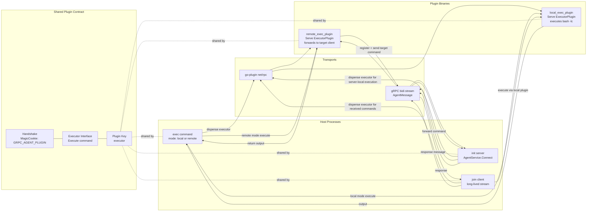
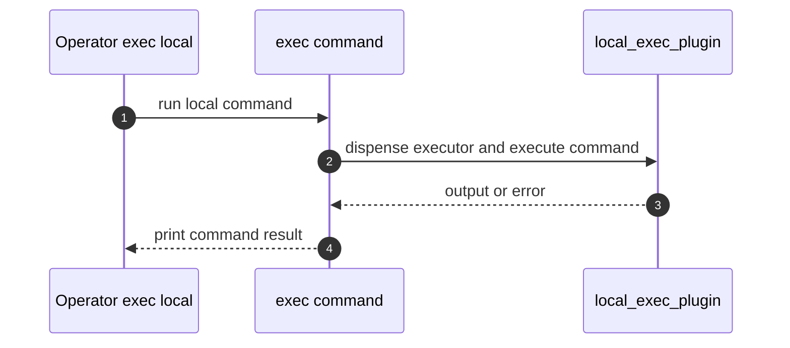
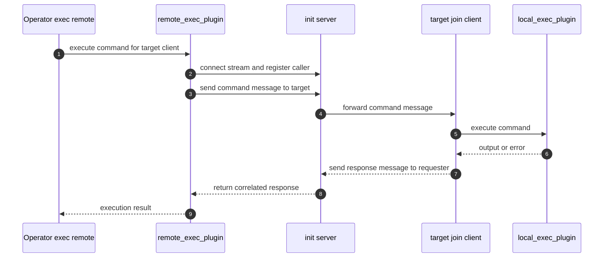

# grpc-agent

A gRPC-based command execution agent with pluggable executors using HashiCorp go-plugin.

grpc-agent has three runtime roles:

- Server (`init`) that maintains long-lived bi-directional streams to connected agents.
- Agent client (`join`) that stays connected and executes commands sent by the server.
- Operator CLI (`exec`) that runs commands in `local` or `remote` mode through plugins.

The same plugin interface is used for both local and remote execution paths.

## Architecture Diagram



### Local Execution Sequence



### Remote Execution Sequence



## How It Works

### High-level components

- `main.go`: Cobra root command wiring.
- `cmd/init.go`: Bi-directional gRPC server (`AgentService.Connect`) and routing logic.
- `cmd/join.go`: Long-lived agent process that receives commands and executes them locally through a plugin.
- `cmd/exec.go`: Operator command that selects mode (`local` or `remote`) and dispatches to the corresponding plugin.
- `shared/executor.go`: Shared go-plugin handshake, plugin map, and `Executor` interface.
- `plugins/local_exec_plugin/main.go`: Plugin implementation that runs command via `bash -lc`.
- `plugins/remote_exec_plugin/main.go`: Plugin implementation that forwards command over gRPC to a target client.
- `proto/agent.proto`: Bi-directional stream contract (`AgentMessage`).

### Data flow

Local mode (`grpc-agent exec local ...`):

1. `exec` starts `local_exec_plugin` through go-plugin.
2. Host dispenses `executor` and calls `Execute(command)`.
3. Plugin runs `bash -lc <command>` and returns output.

Remote mode (`grpc-agent exec remote <target> ...`):

1. `exec` starts `remote_exec_plugin` through go-plugin.
2. Host calls plugin `Execute(command)`.
3. Remote plugin opens gRPC stream to server, registers as caller, forwards command to `<target>`.
4. Server forwards command to target client's stream.
5. Target `join` executes command locally via `local_exec_plugin`.
6. Response returns via server back to remote plugin, then to `exec`.

## Plugin Wiring (HashiCorp go-plugin)

The plugin system is wired in `shared/executor.go` and follows the standard host/plugin pattern from go-plugin examples.

### Shared contract

- Handshake:
     - `MagicCookieKey=GRPC_AGENT_PLUGIN`
     - `MagicCookieValue=simpleagent`
     - `ProtocolVersion=1`
- Interface:
     - `type Executor interface { Execute(ctx context.Context, command string) (string, error) }`
- Plugin key:
     - `executor`

### Host side usage

Host processes (`exec`, `init`, `join`) do:

1. `plugin.NewClient(...)` with shared handshake + plugin map.
2. `Client()` to establish RPC channel.
3. `Dispense("executor")`.
4. Cast to `shared.Executor` and call `Execute(...)`.

### Plugin side usage

Plugin binaries call `plugin.Serve(...)` with:

- same handshake config
- same plugin key (`executor`)
- implementation of `shared.Executor`

This ensures `local_exec_plugin` and `remote_exec_plugin` present the exact same runtime API to hosts.

## Command Responsibilities

### `init`

- Starts gRPC server on configured port.
- Tracks connected client streams by name.
- Uses a local executor plugin for server-local execution when target is self.
- For remote targets, forwards command to target stream and routes responses back to requester using pending-response correlation.

### `join`

- Connects to server and registers a stable client name.
- Keeps stream open to receive commands.
- Uses `local_exec_plugin` to execute received commands.
- Does not execute shell commands directly in `cmd/join.go`; all command execution is delegated through the plugin interface.
- Sends response message including requester correlation via `target_name`.

### `exec`

- Unified command: `grpc-agent exec [local|remote] ...`
- `local`: uses `local_exec_plugin`.
- `remote`: uses `remote_exec_plugin` and sets target client via environment.

## Environment Variables

Used by remote execution plugin:

- `GRPC_AGENT_SERVER_ADDR`: gRPC server address (default `localhost:50051`).
- `GRPC_AGENT_CLIENT_NAME`: caller identity used when registering stream.
- `GRPC_AGENT_TARGET_CLIENT`: remote target client name (set by `exec remote`).

Optional server-side override:

- `EXECUTOR_PLUGIN`: path to plugin binary used by `init` for server-local execution.

## Installation

```bash
go install github.com/tamalsaha/grpc-agent@latest
```

Or build from source:

```bash
make all
```

## Usage

### 1) Start server

```bash
./grpc-agent init --port 50051
```

### 2) Start one or more joined clients

```bash
./grpc-agent join --server localhost:50051 --name client-a
./grpc-agent join --server localhost:50051 --name client-b
```

### 3) Execute commands

Local execution (via local plugin):

```bash
./grpc-agent exec --server localhost:50051 --name operator local "echo local-ok"
```

Remote execution (via remote plugin over bidi server):

```bash
./grpc-agent exec --server localhost:50051 --name operator remote client-a "hostname"
```

## Commands

| Command | Description |
|---------|-------------|
| `init` | Start the bi-directional streaming gRPC server |
| `join` | Start a gRPC client that listens for commands |
| `exec` | Execute commands through plugins in `local` or `remote` mode |
| `remote_exec` | Legacy remote execution command |

## Protocol

The service uses a bi-directional stream:

```text
client <----> server
     stream AgentMessage
```

`AgentMessage` fields:

- `client_name`: sender identity.
- `target_name`: forwarding target or requester correlation.
- `command`: command string.
- `output`: command output or error text.
- `is_response`: indicates request vs response frame.

## Build and Test

```bash
# Unit/package build check
go test ./...

# Build main binary
make build

# Build plugins
make build-plugins

# Build everything
make all

# Run end-to-end integration test
make integration-test

# Clean
make clean
```

## Troubleshooting

- Plugin handshake errors:
  - Ensure host and plugin binaries are built from the same commit.
  - Ensure `shared/executor.go` handshake constants match between host and plugin.
- Remote mode hangs:
  - Confirm target client is running `join` and is registered.
  - Verify server/client names are unique and stable.
  - Verify `--server` points to the same server for `init`, `join`, and `exec`.
- Plugin not found:
  - Build plugins with `make build-plugins`.
  - Keep expected binary paths under `plugins/<name>/<name>`.

## Generate Proto

```bash
# Using protoc
protoc --go_out=proto/gen --go_opt=paths=source_relative \
       --go-grpc_out=proto/gen --go-grpc_opt=paths=source_relative \
       proto/agent.proto

# Using buf
buf generate
```
